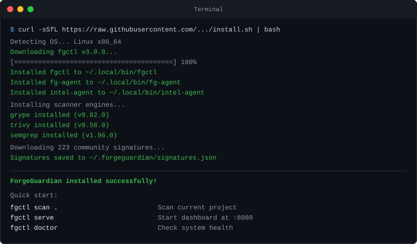
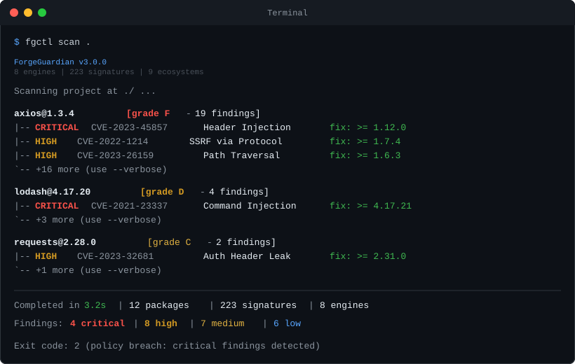
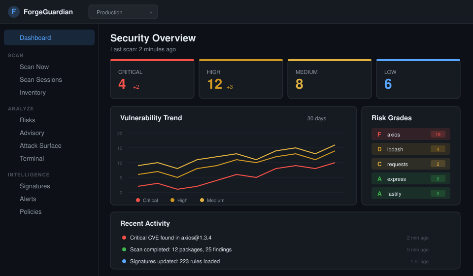

<p align="center">
  
</p>

<h1 align="center">ForgeGuardian</h1>

<p align="center">
  <strong>Supply chain security scanner for every package you depend on.</strong><br/>
  8 engines. 9 ecosystems. 223+ detection signatures. Works offline.
</p>

<p align="center">
  
  
  
  
</p>

---

## Install

One command. No account needed.

```bash
curl -sSfL https://raw.githubusercontent.com/Mah3Sec/ForgeGuardian/main/install.sh | bash
```

<details>
<summary>Windows (PowerShell)</summary>

```powershell
irm https://raw.githubusercontent.com/Mah3Sec/ForgeGuardian/main/install.ps1 | iex
```
</details>

<details>
<summary>Docker</summary>

```bash
docker run -d --name forgeguardian -p 3000:3000 ghcr.io/mah3sec/forgeguardian
```
Open **http://localhost:3000**
</details>

<details>
<summary>Build from source</summary>

```bash
git clone https://github.com/Mah3Sec/ForgeGuardian.git
cd ForgeGuardian && make build
```
</details>

<p align="center">
  
</p>

---

## Scan

```bash
fgctl scan .
```

That's it. Scans your project, shows findings with severity and fix versions.

<p align="center">
  
</p>

---

## Dashboard

Start the web dashboard:

```bash
fgctl serve
```

Open **http://localhost:8080** — SOC-style overview with risk heatmap, severity trends, and real-time alerts.

<p align="center">
  
</p>

**Live demo:** [forgeguardian.mahendrapurbia.com](https://forgeguardian.mahendrapurbia.com)

The dashboard includes 30+ pages: scan (registry + file upload + remote SSH), scan history with export, inventory, AI advisory, SBOM, Sigstore signing, provenance, live monitoring, built-in web terminal, signature authoring, alerts, policies, webhooks, and more.

---

## 8 Scan Engines

Every scan runs all available engines concurrently:

| Engine | Status | What it catches |
|---|---|---|
| **OSV** | always runs | Known CVEs via osv.dev |
| **Behavioral** | always runs | Malicious install scripts, typosquatting |
| **Malware** | always runs | Byte/regex pattern matching |
| **AI Model** | always runs | Unsafe HuggingFace weights |
| **MCP** | always runs | Prompt injection in tool descriptions |
| **Grype** | optional | Deep CVE scan of artifacts |
| **Trivy** | optional | Container + OS scanning |
| **Semgrep** | optional | SAST static analysis |

Missing an optional engine? Run `fgctl doctor --fix` to auto-install them.

---

## 9 Ecosystems

npm, PyPI, Go, Maven, RubyGems, Cargo/crates.io, NuGet, HuggingFace, GitHub Actions

---

## 223+ Community Signatures

ForgeGuardian ships with 223+ detection signatures covering real supply chain attacks (2016-2026):

| Type | What it catches | Count |
|---|---|---|
| `blocklisted_package` | Confirmed malicious packages (event-stream, XZ utils, Shai-Hulud worm...) | 80 |
| `behavioral_rule` | Install-time env harvest, SSH key theft, dep confusion | 42 |
| `malware_pattern` | Obfuscated loaders, crypto miners, RATs, credential stealers | 44 |
| `typosquatting_target` | Popular packages + known typosquat variants | 27 |
| `mcp_injection_pattern` | Tool shadowing, data exfil via MCP | 13 |
| `pickle_rule` | Unsafe AI model weights, missing model cards | 12 |

**Update signatures:**
```bash
fgctl update
```

**Create your own:**
```bash
fgctl intel new          # guided wizard
fgctl intel validate .   # validate schema
fgctl intel test .       # test against real package
```

---

## CI/CD

Drop into any GitHub Actions workflow:

```yaml
- name: Install ForgeGuardian
  run: |
    curl -sSfL https://raw.githubusercontent.com/Mah3Sec/ForgeGuardian/main/install.sh | bash
    echo "$HOME/.local/bin" >> $GITHUB_PATH

- name: Scan
  run: fgctl scan . --ci --fail-on=high --format=sarif > results.sarif

- name: Upload to GitHub Security
  uses: github/codeql-action/upload-sarif@v3
  with:
    sarif_file: results.sarif
```

---

## Key Features

- **Offline-first** — all scans run locally, no data leaves your machine
- **AI triage** — optional AI advisory and patch agent (needs `ANTHROPIC_API_KEY`)
- **SBOM** — CycloneDX 1.5 + SPDX 2.3 generation
- **Sigstore signing** — keyless artifact signing + verification
- **Policy-as-code** — YAML policy rules, deny lists, threshold enforcement
- **Webhooks** — Slack, Discord, generic HTTP alerts
- **Risk scoring** — A-F letter grades per package
- **Self-hostable** — Docker one-liner, airgap-compatible
- **SLSA Level 3** — provenance for every release

---

## Free vs Pro

The engine, CLI, and community tools are **Apache 2.0, free forever**. Pro adds team features.

| | Community (Free) | Pro |
|---|---|---|
| CLI scan + all 8 engines | Yes | Yes |
| SBOM, signing, provenance | Yes | Yes |
| Community signatures | Yes | Yes |
| Dashboard (self-hosted) | Yes | Yes |
| Alerts, policies, webhooks | Yes | Yes |
| AI advisory + patch agent | Yes | Yes |
| Team management + RBAC | — | Yes |
| Cloud-hosted option | — | Yes |
| SLA + priority support | — | Yes |

---

## Privacy

- Zero telemetry — phones home for nothing
- AI features are opt-in (explicit `ANTHROPIC_API_KEY`)
- Self-hostable and airgap-compatible
- SBOMs and provenance published for every release

---

## Contributing

Fastest path: **write a detection signature** — no Go knowledge needed:

```bash
fgctl intel new    # guided wizard, ~10 minutes
```

For code contributions: fork, branch, PR. See [CONTRIBUTING.md](CONTRIBUTING.md).

Security issues: [SECURITY.md](SECURITY.md).

---

## License

Apache License 2.0 — [LICENSE](LICENSE)
